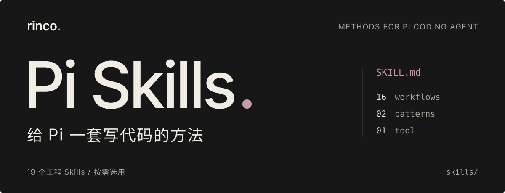

# Rinco Pi Skills

<p align="center">
  
</p>

给 [Pi coding agent](https://github.com/earendil-works/pi) 用的 **24 个工程 Skills**，把问需求、查 Bug、写测试和检查结果的方法交给 AI。

每个 Skill 都是一份可按需读取的做事说明，**不是新模型，也不是自动跑到底的程序**。你可以直接描述任务，也可以点名指定方法。

[快速开始](#快速开始) · [选择 Skill](#选择-skill) · [完整目录](#完整目录) · [维护仓库](#维护仓库)

## 一个 Bug，三份有依据的结果

以原因不明的 Bug 为例，可以这样搭配：

| 方法 | 要留下的结果 |
|---|---|
| `systematic-debugging`：先查原因 | 可复现的问题、支持根因判断的证据；先不修代码 |
| `tdd`：测试先行 | 能复现问题的失败测试，以及修复后的通过结果 |
| `verification`：最后检查 | 实际运行的检查及其结果，明确失败或受阻的项目 |

这是组合示例，不是强制流水线。原因已经查明就从修复开始；只想评审代码，也不必补一套需求和计划。

## 快速开始

先安装并配置好 Pi。脚本需要 **Bash 4+ 和 GNU `find`**；macOS 自带的版本不能直接运行，需先准备兼容工具并确保脚本调用的是 GNU `find`。

> [!WARNING]
> 默认安装到 `~/.pi/agent/skills/`，供所有项目使用。再次安装会覆盖同名文件；请先备份对已安装 Skills 的自定义修改。

在终端执行，安装全部 24 个 Skills：

```bash
git clone https://github.com/Rinisnotarobot/rinco-pi-skills-commands.git
cd rinco-pi-skills-commands
bash scripts/install.sh
```

然后在你要开发的项目里重新打开 Pi，输入：

```text
/skill:spec 我要做一个 CSV 批量导入功能，帮我写清楚要做什么、出错时怎么办、怎样算完成。
```

**预期结果**：一份需求规格文档，写明需求、边界和验收条件，不直接实现功能。尚未确定的关键决定会先向你确认。

<details>
<summary>只装几个、只给一个项目用，或者更新与卸载</summary>

**只装需要的 Skills**（仍在本仓库目录执行）：

```bash
bash scripts/install.sh spec plan tdd verification
```

**只给一个项目用**，把路径换成你的项目路径：

```bash
bash scripts/install.sh --scope /path/to/your-project/.pi/skills spec plan tdd verification
```

`--scope .pi/skills` 指的是终端当前目录下的 `.pi/skills`。如果你还在这个 Skills 仓库里，它就会装到这个仓库，而不是你正在开发的项目。

**确认文件已安装**（以全局安装为例）：

```bash
ls ~/.pi/agent/skills/spec/SKILL.md
```

**更新**：拉取本仓库最新代码，再执行安装命令；本仓库不单独维护版本号。

**卸载**：删除安装目录里对应的 Skill 文件夹，例如全局安装的 `~/.pi/agent/skills/spec/`。删除前确认其中没有需要保留的自定义内容。

单独安装 `session-handoff` 时，会自动补装 `living-docs-governance`，因为交接文档的格式定义在后者里。`fastapi`、`ts-frontend`、`ts-backend` 同理，会各自补装它上面的决策 Skill（`python-project`、`frontend-patterns`、`backend-patterns`）。其他 Skills 可以独立安装。

</details>

## 如何使用

**平时直接说要做什么**，Pi 会按任务选择匹配的 Skill。例如：

```text
这个接口偶尔返回 500。先帮我复现并查清原因，不要猜着改。
```

**想指定做法，就点名调用**：

```text
/skill:systematic-debugging 查一下这个接口为什么偶尔返回 500。
```

前者让 Pi 按任务匹配方法，后者由你指定。**安装 Skill 不保证任务成功，完成与否仍以实际检查为准。**

两个入口只接受显式调用：`publish-tickets` 发布已批准的计划工单，`session-handoff` 保存会话交接文档。交接后仍需在新会话中让 Pi 读取文档，它不是自动跨会话记忆。

<a id="真实场景组合"></a>

## 选择 Skill

| 你的任务 | 建议组合 |
|---|---|
| 想法还模糊 | grilling → spec → plan |
| 需求明确，要实现功能 | plan → tdd → verification |
| Bug 根因未知 | systematic-debugging → tdd → verification |
| 构建或 CI 失败且原因明确 | fix → verification |
| 评审一组变更 | verification → code-review |
| 在陌生的 Python / TypeScript 项目里写代码 | python-project → fastapi · ts-frontend · ts-backend |
| 会话太长，需要交接 | `/skill:session-handoff` |

想换一种行为是新需求，不一定是 Bug。测试通过、评审通过、获准发布也分别是不同的结论。更多阶段边界和搭配理由见 [Workflows 设计与用法](skills/workflows/README.md)。

## 完整目录

正式安装目录分为 **16 个 Workflows + 3 个 Patterns + 4 个 Stacks + 1 个 Tool**。下列链接进入对应 Skill 目录，完整规则见其中的 `SKILL.md`。

<details>
<summary>Workflows · 16 个开发方法（展开查看用途与调用方式）</summary>

| Skill | 调用方式 | 用途 |
|---|---|---|
| [`grilling`](skills/workflows/grilling/) | 自动 / 显式 | 追问想法中的细节和边界，把没想清楚的地方找出来。 |
| [`spec`](skills/workflows/spec/) | 自动 / 显式 | 把需求写清楚，包括要做什么、怎样才算完成。 |
| [`plan`](skills/workflows/plan/) | 自动 / 显式 | 列出改哪些文件、分几步做、每步怎么检查。 |
| [`prototype`](skills/workflows/prototype/) | 自动 / 显式 | 先做一个小原型验证想法，不直接改正式功能。 |
| [`publish-tickets`](skills/workflows/publish-tickets/) | 显式 | 把你批准的计划按原有拆分发布成工单。 |
| [`fix`](skills/workflows/fix/) | 自动 / 显式 | 查清原因后做最小修复，再检查是否修好。 |
| [`systematic-debugging`](skills/workflows/systematic-debugging/) | 自动 / 显式 | 复现问题、逐个验证猜测，找到原因后再修。 |
| [`tdd`](skills/workflows/tdd/) | 自动 / 显式 | 每次做一小块：先写失败的测试，再实现，最后整理代码。 |
| [`verification`](skills/workflows/verification/) | 自动 / 显式 | 实际运行检查，说明通过了、没通过，还是被什么卡住。 |
| [`code-review`](skills/workflows/code-review/) | 自动 / 显式 | 检查代码改动，写下发现的问题和依据，不直接改代码。 |
| [`codebase-design`](skills/workflows/codebase-design/) | 自动 / 显式 | 帮助分析模块怎么拆、接口怎么设计、哪里方便测试。 |
| [`coding-standards`](skills/workflows/coding-standards/) | 自动 / 显式 | 结合现有代码，检查新代码是否容易理解和维护。 |
| [`domain-modeling`](skills/workflows/domain-modeling/) | 自动 / 显式 | 统一业务术语，为重要且难撤回的设计决定留下记录。 |
| [`living-docs-governance`](skills/workflows/living-docs-governance/) | 自动 / 显式 | 明确各份文档负责什么，减少重复、过期和信息丢失。 |
| [`resilience`](skills/workflows/resilience/) | 自动 / 显式 | 考虑超时、重试、重复请求、过载以及出错后怎么恢复。 |
| [`session-handoff`](skills/workflows/session-handoff/) | 显式 | 记录做到哪、下一步做什么，让新会话接着干。 |

</details>

<details>
<summary>Patterns、Stacks 与 Tools · 前后端设计、安全检查、技术栈常识、README</summary>

### Patterns

| Skill | 用途 |
|---|---|
| [`backend-patterns`](skills/patterns/backend-patterns/) | 根据项目需要，选择服务拆分、数据一致性、消息和缓存等方案。 |
| [`frontend-patterns`](skills/patterns/frontend-patterns/) | 根据用户旅程和平台约束，选择界面组合、状态、渲染、交互与性能方案。 |
| [`security-review`](skills/patterns/security-review/) | 检查数据和权限边界，只报告能说明完整利用过程的安全问题。 |

### Tools

| Skill | 用途 |
|---|---|
| [`readme`](skills/tools/readme/) | 根据仓库实际内容写或检查 README，核对关键说明和链接。 |

### Stacks

技术栈常识：先读仓库判断这项目实际怎么做的，再按它的写法干活，不是套模板。

| Skill | 用途 |
|---|---|
| [`python-project`](skills/stacks/python-project/) | 任何 Python 项目的公共底座：工具链、包结构、类型与错误处理、pytest 组织。 |
| [`fastapi`](skills/stacks/fastapi/) | FastAPI 服务层：app factory、配置、Pydantic v2 模式、依赖注入、路由与鉴权、httpx 应用测试。 |
| [`ts-frontend`](skills/stacks/ts-frontend/) | React + TypeScript 前端：hooks 纪律、组件组合、server/client 边界、取数与表单、渲染成本、RTL 组件测试。 |
| [`ts-backend`](skills/stacks/ts-backend/) | Node.js + TypeScript 服务端：工程与模块配置、依赖注入与应用组装、校验与错误映射、事务与后台任务、遥测与进程健康、NestJS 形态。 |

</details>

## 维护仓库

`skills/` 是正式安装来源；`processing/` 是草稿区，不计入 24 个 Skills。`.pi/skills/` 仅用于维护本仓库，不随安装脚本分发。

<details>
<summary>仓库结构与新增 Skill 的步骤</summary>

```text
.
├── .pi/skills/          # 维护本仓库时使用的辅助 Skills
├── assets/readme/       # README 头图
├── skills/              # 安装脚本从这里复制
│   ├── workflows/       # 开发步骤与做事方法
│   ├── patterns/        # 前后端设计与安全检查
│   ├── stacks/          # 技术栈常识（Python、FastAPI、React、Node 后端）
│   └── tools/           # README 工具
├── skills-lock.json     # .pi/skills/ 两个辅助 Skill 的来源与内容哈希
├── processing/          # 草稿区与提升前自查清单
└── scripts/
    ├── install.sh       # 安装或更新 Skills
    └── validate.sh      # 检查结构、链接和目录
```

新增或修改 Skill 时：

1. 先在 `processing/skills/<name>/` 起草，按[草稿区说明](processing/README.md)的自查清单验证。
2. 准备好正式使用后，放入 `skills/<family>/<name>/`。
3. 同步更新本页的完整目录；Workflows 还需更新其[分组导航](skills/workflows/README.md)。

</details>

提交前运行仓库检查：

```bash
bash scripts/validate.sh
```

检查名称与描述、链接、参考文档可达性、README 目录、调用方式和 Git 空白错误。这些是结构检查，不代表 Skill 在实际任务中的效果已经通过验证。
