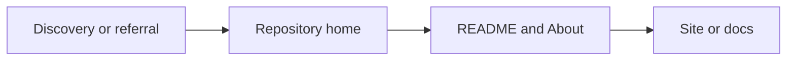

# GitHub SEO / GEO 平台策略（按需加载）

GitHub is a Tier 2 Technical Authority platform — high domain authority, fast indexing, very high AI citation probability. This reference covers platform-level SEO/GEO strategy beyond README authoring (which lives in the main SKILL.md).

## Why GitHub for SEO

| Factor | Effect |
|--------|--------|
| **Domain authority** | High DA; repos, gists, Pages rank well |
| **Fast indexing** | Search engines crawl GitHub frequently |
| **AI citation** | ChatGPT, Perplexity cite GitHub for technical queries |
| **Technical expertise** | Strong expertise signals; structured docs become AI reference material |
| **Cross-platform** | Share across Dev.to, Stack Overflow, forums; amplifies visibility |

## Use Cases

| Use case | Format | Purpose |
|----------|--------|---------|
| **Parasite SEO** | Repos, README, Pages, gists | Leverage GitHub authority for rankings and backlinks |
| **GEO** | Documentation, tutorials, curated lists | AI tools cite GitHub for technical answers |
| **Curated / navigation lists** | Awesome-style repos | Topic-specific resource directories; backlinks, discovery |

## Repository home: layout map

| Area | Typical contents | SEO / ops note |
|------|------------------|----------------|
| **Main column** | File list; rendered **root README** below | First screen and H2/H3 carry most narrative |
| **About sidebar** | **Description**, **Website**, **Topics**, releases shortcut, license, languages | Keep Description and README first paragraph consistent; **Website** should match the primary outbound CTA |
| **Other tabs** | Issues, PRs, Actions, etc. | Engagement and freshness signals |

## In-site discovery (high level)

| Entry | Role | Caveat |
|-------|------|--------|
| **Trending** | Time-windowed visibility | Formula is **not** public; never promise ranking |
| **Explore** | Collections, themes, programs | Useful for patterns and seasonal campaigns |
| **Topics** | Topic pages tied to repository topics | Aligns with Topics metadata |
| **Search** | Query across repos and users | README + About + topics drive match quality |

UI and URLs evolve; verify on [github.com](https://github.com/).

## Metadata ranking weight

**Ranking weight** (GitHub + Google): Repository name & About ≈ highest; Topics ≈ high; README ≈ high.

### Repository Name

| Practice | Guideline |
|----------|-----------|
| **Descriptive** | Hint at what the project does |
| **Keyword-rich** | Include primary keywords (`markdown-editor` not `my-project`) |
| **Hyphens** | Separate words (`react-component-library`) |
| **Concise** | Shorter = memorable, shareable |

### About Section (Description)

| Limit | Guideline |
|-------|-----------|
| **350 chars** | Hard limit; GitHub enforces |
| **~128 chars** | Optimal for brevity; often displayed fully |
| **Content** | Primary keyword + natural variations; what it does, who it's for; link to website or docs if space |

**Example**: "A fast, lightweight markdown editor for React with live preview, syntax highlighting, and export to PDF. Built with TypeScript."

### Topics

| Limit | Guideline |
|-------|-----------|
| **6–20 topics** | Max 20; 6–10 recommended |
| **~50 chars** each | Per topic |
| **Format** | Lowercase, hyphens, numbers only |
| **Mix** | Technology (react, python), purpose (cli, library), category (seo, ai-tools), community (hacktoberfest) |

**Underutilized** but highly effective for discoverability and GEO.

## Parasite SEO on GitHub

### Key Surfaces

| Surface | Use |
|---------|-----|
| **README** | Landing page for repo; keyword-optimized summary, headings, links |
| **GitHub Pages** | Static site; blog, FAQ, docs; additional ranking opportunities |
| **Gists** | Micro-content; long-tail keywords; link to repos or external resources |
| **Wiki** | Keyword-rich documentation |
| **Issues** | Q&A, discussions; indexable |

### GitHub Pages vs README

| Surface | Role |
|---------|------|
| **README** | First impression; Stars/forks; short pitch and deep links |
| **Pages** | Multi-page **static** site: long docs, blog, changelog |

**Default URL patterns**: A **user or organization site** often uses a `username.github.io` repository and serves at `https://username.github.io`. A **project site** is published from a given repo and typically appears at `https://username.github.io/repository/` (path may vary with settings). See [About GitHub Pages](https://docs.github.com/en/pages/getting-started-with-github-pages/about-github-pages).

**Limits**: Build size, bandwidth, and build-frequency caps change over time — cite [GitHub Pages limits](https://docs.github.com/en/pages/getting-started-with-github-pages/github-pages-limits) when users need numbers, not hard-coded figures from this skill.

### Optimization

| Element | Practice |
|---------|----------|
| **Repository title** | Primary keywords; descriptive; hyphens |
| **About** | 350 chars max; keyword-rich; primary keyword + natural variations |
| **Description** | Secondary keywords; link to website or resources |
| **README** | Keyword-optimized summary first; headings, bullet points; screenshots; links to docs, tutorials |
| **Topics / tags** | 6–20 relevant topics; 50 chars each |
| **GitHub Pages** | Mobile-friendly; metadata; blog/FAQ for extra keywords |

### Gists for Micro-Content

- Target specific long-tail keywords
- Link back to larger repos or external resources
- Share code snippets, small utilities

## GEO on GitHub

| Factor | Practice |
|--------|----------|
| **README clarity** | Clear, citable paragraphs; direct answers |
| **Documentation** | Structured; AI tools parse well |
| **Entity signals** | Clear project, author identity; consistent naming and links |
| **Consistency** | Active maintenance; engagement (stars, forks, watchers) |

## Community Engagement

- Respond to issues and PRs; builds trust
- Contribute to popular projects; backlinks, visibility
- Keep repos updated; outdated = lower credibility

## Curated / Navigation Lists (Awesome-Style)

**Awesome lists** = curated, topic-specific resource lists on GitHub. Function like navigation directories; high traffic, backlinks, discovery. sindresorhus/awesome (441K+ stars) is the master list; 6,500+ curated lists exist across topics.

### Examples by Category

| Category | Examples |
|----------|----------|
| **Master list** | sindresorhus/awesome — hub of all awesome lists |
| **SEO / Marketing** | awesome-seo, awesome-ai-seo, bmpi-dev/awesome-seo |
| **AI / ML** | awesome-ai-tools, AITreasureBox, awesome-ai |
| **Dev tools** | awesome-tools, awesome-cli, awesome-nodejs |
| **Languages** | awesome-python, awesome-javascript, awesome-go |
| **Frontend / Backend** | awesome-react, awesome-vue, awesome-django |
| **Other** | awesome-security, awesome-gaming, awesome-databases |

### When to Create

- You have a niche with many quality resources to curate
- Existing lists lack coverage of your topic
- You want a backlink asset and topical authority

### List Structure (sindresorhus/awesome guidelines)

| Element | Practice |
|---------|----------|
| **Title** | Clear, focused (e.g., "Awesome SEO," "Awesome AI Tools") |
| **Description** | Succinct; scope clear |
| **Sections** | Categorized (e.g., Tutorials, Tools, Articles) |
| **Items** | Curated, not collected; only include what you recommend |
| **Item format** | `- [Name](URL) - Brief description of why it's awesome` |
| **License** | CC0 or similar |
| **Contributing** | contributing.md for PR process |

### Getting Listed vs. Creating

| Action | Use |
|--------|-----|
| **Submit to existing list** | PR to awesome-* repos; follow list format; contact maintainer |
| **Create new list** | When no list exists for your niche; follow awesome guidelines |
| **Link between lists** | Link to other awesome lists that cover subjects better |

### Discovery

- **sindresorhus/awesome** — Master list of awesome lists
- **AwesomeSearch** — Search across awesome lists
- **more-awesome** — Directory of awesome lists

## Common Mistakes

| Mistake | Avoid |
|---------|-------|
| **Ignoring engagement** | Not responding to issues/PRs reduces trust |
| **Irregular updates** | Outdated repos signal inactivity |
| **Incomplete docs** | Lack of clear descriptions frustrates users |
| **Generic titles** | Missing keywords reduces discoverability |
| **Thin awesome lists** | Low-quality or uncurated items hurt credibility |
| **Profile README = product README** | Pasting install/Contributing/screenshot-heavy templates on `username/username` |
| **Link sprawl on profile** | Same homepage/social/email repeated in badges, tables, and long copy — consolidate |

## Scope Notes

- This reference covers **GitHub only**. For SEO/GEO on non-GitHub platforms, work with the user's general instructions instead of assuming a platform-specific skill exists.
- For open source **business models**, the same principles here (README clarity, entity signals, curated assets) apply; commercial strategy is out of scope.
